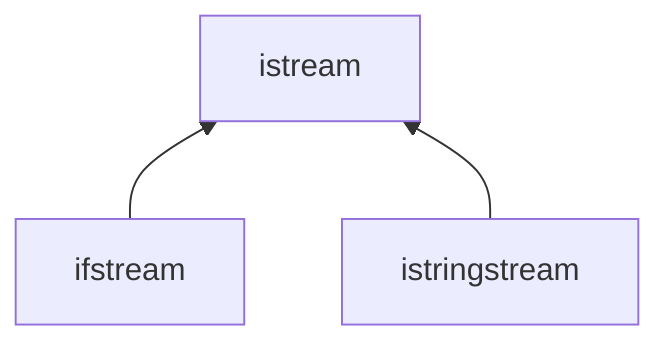

# 第八章 IO库

## 前面章节已介绍的IO库设施

[[ch01#IO | 第一章-初识输入输出]]

- **istream**：输入流类型，提供输入操作。
- **ostream**：输出流类型，提供输出操作
- **cin**：一个`istream`对象，从标准输入(stdin)读取数据。
- **cout**：一个`ostream`对象，向标准输出(stdout)写入数据。
- **cerr**：一个`ostream`对象，向标准错误(stderr)写入消息（不缓冲）。
- **clog**：一个`ostream`对象，向标准错误(stderr)输出程序运行时的一般性信息（缓冲）。
- **>>运算符**：用来从一个`istream`对象中读取输入数据。
- **<<运算符**：用来向一个`ostream`对象中写入输出数据。
- **getline函数**：从一个给定的`istream`对象中读取一行数据，存入到一个给定的`string`对象中。
  
## 8.1 IO类

### 标准库定义的IO类型

C++语言不直接处理输入输出，而是通过一簇定义在标准库中的类型来处理IO。

头文件 | 类型 | 说明
:--:|:--:|:--:
iostream | istream, ostream, iostream | 从标准流中读写数据
fstream | ifstream, ofstream, fstream | 从文件中读写数据
sstream | istringstream, ostringstream, stringstream | 从字符串中读写数据

继承关系（其他类型同理）

### IO对象不可复制或赋值

1. IO对象不能存在容器里.
2. 形参和返回类型也不能是流类型。
3. 形参和返回类型一般是流的**引用**。
4. 读写一个IO对象会改变其状态，因此传递和返回的引用不能是`const`的。

### 条件状态

将流当做条件使用的代码就等价于`!fail()`

| 状态      | 解释 |
| ----------- | ----------- |
| `strm:iostate` | 是一种机器无关的**类型**，提供了表达条件状态的完整功能 |
| `strm:badbit` | 用来指出流已经崩溃(系统级错误，流无法再使用) |
| `strm:failbit` | 用来指出一个IO操作失败了 |
| `strm:eofbit` | 用来指出流到达了文件结束 |
| `strm:goodbit` | 用来指出流未处于错误状态，此值保证为零 |
| `s.eof()` | 若流`s`的`eofbit`置位，则返回`true` |
| `s.fail()` | 若流`s`的`failbit`或`badbit`置位，则返回`true` |
| `s.bad()` | 若流`s`的`badbit`置位，则返回`true` |
| `s.good()` | 若流`s`处于有效状态，则返回`true` |
| `s.clear()` | 将流`s`中所有条件状态位复位，将流的状态设置成有效，返回`void` |
| `s.clear(flags)` | 将流`s`中指定的条件状态位**复位**，返回`void` |
| `s.setstate(flags)` | 根据给定的标志位，将流`s`中对应的条件状态位**置位**，返回`void` |
| `s.rdstate()` | 返回流`s`的当前条件状态，返回值类型为`strm::iostate` |

上表中，`strm`是一种IO类型（如`istream`）， `s`是一个流对象，`flags`的类型为`strm::iostate`

### 管理输出缓冲

- 每个输出流都管理一个缓冲区，执行输出的代码，文本串可能立即打印出来，也可能被操作系统保存在缓冲区内，随后再打印。
- 刷新缓冲区，可以使用如下IO操纵符：
  - `endl`：输出一个换行符并刷新缓冲区。
  - `flush`：刷新流，但不添加任何字符。
  - `ends`：在缓冲区插入空字符`null`(`\0`)，然后刷新缓冲区。
  - `unitbuf`：告诉流接下来每次操作之后都要进行一次`flush`操作。
  - `nounitbuf`：回到正常的缓冲方式。

> 如果程序崩溃，输出缓冲区不会被刷新

**关联输入和输出流**

> 标准库将cout和cin关联在一起，因此cin会导致cout的缓冲区被刷新

> 每个流同时最多关联到一个输出流

- `s.tie()`：返回当前对象关联到的输出流指针，如果对象未关联到流，则返回空指针
- `s.tie(sp)`：将当前对象关联到指针`sp`指向的输出流对象，返回之前关联的流指针；`sp`为空指针时，表示解开流的关联

## 8.2 文件输入输出

- 头文件`fstream`定义了三个类型来支持文件IO：
  - `ifstream`从一个给定文件读取数据。
  - `ofstream`向一个给定文件写入数据。
  - `fstream`可以读写给定文件。
- **文件流**：需要读写文件时，必须定义自己的文件流对象，并绑定在需要的文件上。

### fstream特有的操作

| 操作      | 解释 |
| ----------- | ----------- |
| `fstream fstrm;` | 创建一个未绑定的文件流。 |
| `fstream fstrm(s);` | 创建一个文件流，并打开名为`s`的文件，`s`可以是`string`也可以是`char`指针，此构造函数是`explicit`的 |
| `fstream fstrm(s, mode);` | 与前一个构造函数类似，但按指定`mode`打开文件 |
| `fstrm.open(s)` | 打开名为`s`的文件，并和`fstrm`绑定 |
| `fstrm.close()` | 关闭和`fstrm`绑定的文件 |
| `fstrm.is_open()` | 返回一个`bool`值，指出与`fstrm`关联的文件是否成功打开且尚未关闭 |

上表中，`fstream`是头文件`fstream`中定义的一个类型，`fstrm`是一个文件流对象。

> 当一个`fstream`对象被销毁时，`close`会自动被调用

### 文件模式

| 文件模式 | 解释 |
| ----------- | ----------- |
|`in` | 以读的方式打开 |
| `out` | 以写的方式打开 |
| `app` | append，每次写操作前均定位到文件末尾 |
| `ate` | at end，打开文件后立即定位到文件末尾 |
| `trunc` | 截断文件 |
| `binary` | 以二进制方式进行IO操作。 |

> 以`out`模式打开的文件也会被截断，如若想要保留，则需指定`app`模式或`in`模式

## 8.3 string流

- 头文件`sstream`定义了三个类型来支持内存IO：
  - `istringstream`从`string`读取数据。
  - `ostringstream`向`string`写入数据。
  - `stringstream`可以读写给定`string`。

### stringstream特有的操作

| 操作 | 解释 |
| ----------- | ----------- |
|`sstream strm` | 定义一个未绑定的`stringstream`对象 |
| `sstream strm(s)` | 用`s`初始化对象，此构造函数是`explicit`的 |
| `strm.str()` | 返回`strm`所保存的`string`的拷贝 |
| `strm.str(s)` | 将`s`拷贝到`strm`中，返回`void` |

上表中`sstream`是头文件`sstream`中任意一个类型。`s`是一个`string`。
